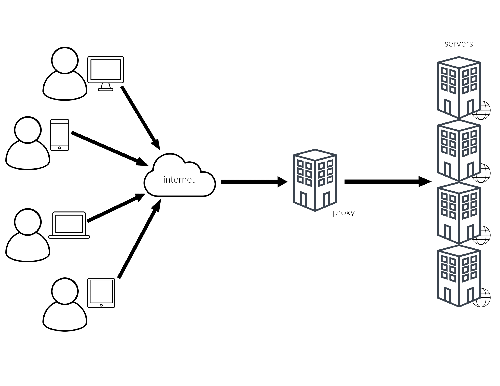

# Proxy library  

The `proxy` library is useful for proxying requests to origins. Use it to create `fetch` like functions for making requests to other backend services. 

## Overview 

First of all, the word "proxy" describes something acting on behalf of something else. In the computer realm, we are talking about one server acting on the behalf of another computer. In layman’s terms, a proxy server acts as a “middleman” between your browser and the website you’re visiting. And when combined with the proper caching methods (add link), it can significantly reduce network usage. 

There are many ways to use Fly as a reverse proxy. Below are a few example scenarios: 

* Offload heavily-used origin servers to improve speed. 
* Deliver content efficiently in geographically dispersed areas to accelerate origin servers that provide content to areas not located within close geographical proximity. 
* Provide security for origin servers that contain sensitive information. 

 This library can be used to balance load among several back-end servers or to provide caching for a slower back-end server. In addition, it can be used simply to bring several servers into the same URL space (See [One hostname to rule them all](https://fly.io/articles/one-hostname-to-rule-them-all-updated-version/)).  

## How it works 

It works by accepting requests for HTTP requests and providing responses, usually by accessing the origin or contact server. 

The `proxy` library generates a fetch-like function that makes requests to any given origin, very similarly to a reverse proxy. It can be particularly useful for load balancing (distributing the load to several web servers), caching static content (offloading web servers by caching content like pictures) and for compressing/optimizing content to speed up web site load time. 

Let’s say you have a large web site that thousands, or even _millions_, of people want to see, but a single web server just can’t handle all that traffic. So, you decide to set up multiple servers and put a reverse proxy on the internet that will send users to the server closest to them when they try to visit your site. This is part of how the Content Distribution Network (CDN) concept works. Overall, you want to direct all incoming requests to multiple servers, and a reverse proxy is a great way to accomplish this. 

When this function makes origin requests, it adds standard proxy headers like `X-Forwarded-Host` and `X-Forwarded-For`. It can handle hostname forwarding, and even rewrites URLs before sending them off to the backend. It also passes headers from the original request to the origin. 



### Before you begin   

Make sure you have the latest version of Fly installed: `npm install -g @fly/fly`   

### Import the proxy library 

`import proxy from '@fly/proxy'` 

### Syntax 

`proxy(origin, options)` 

This method takes 2 **parameters**: `origin` and `options` 

***origin***: a URL in the form of a string  
A URL to an origin (“www.example.com”), which can include a path to rebase requests. 

***options***: ProxyOptions (optional)   
Options and headers to control the origin request. This parameter is optional and the possible options are: 

* `forwardHostHeader`: this option will be a boolean value representing a forward host header from the original request. Without this option, proxy requests infers a host header from the origin URL because it defaults to `false`. To forward host headers sent by visitors, set `forwardHostHeader` to `true`. 

* `headers`: this option will be in the form of an object representing headers to set on backend request. Each header accepts either a boolean or string. 

** If set to `false`, strip header entirely before sending. 

** `true` or `undefined` send the header through unmodified from the original request. 

** `string` header values are sent as is. 

* `stripPath`: this options will be a string that says “replace this portion of URL path before making a request to the origin”. 

For example, this makes a request to `https://fly.io/path1/to/document.html`: 

```javascript 
const opts = { stripPath: "/path2/"}  
const origin = proxy("https://fly.io/path1/", opts) origin("https://somehostname.com/path2/to/document.html") 
``` 

## How to use 

Send all incoming traffic to an Amazon ELB, where the `host` header passes through from the visitor's request: 

```javascript 
const origin = proxy("https://elb1298.amazonaws.com") 

fly.http.respondWith(function (req) { 
    return origin(req) 
}) 
``` 

Or forward host headers sent by visitors by setting `forwardHostHeader` to `true`. This function sends all traffic to an Amazon ELB and includes the host header from original request: 
 
```javascript 
const origin = proxy("https://elb1298.amazonaws.com", { 
    forwardHostHeader: true 
}) 

fly.http.respondWith(function (req) { 
    return origin(req) 
}) 
``` 

And then way more rare, send no host header at all. Usually you'd strip out `x-forwarded-host`, 
since some origins don't like that. This function sends all traffic to an Amazon ELB, but never sends a host header: 
 
```javascript 
const origin = proxy("https://elb1298.amazonaws.com", { 
    headers: { host: false } 
}) 

fly.http.respondWith(function (req) { 
    return origin(req) 
}) 
```

### A couple of ways to get started using the `proxy` library in your own Fly Edge App:

1.  Use this library to make a request to your site, grab all your site's images, convert them to WebP and store them in Fly's global cache ... ultimately dramatically speeding up your site because your users will receive your content form whichever Fly datacenter is closest to them. See this example in action, [here](https://fly.io/articles/google-lighthouse-series-part-one-improve-scores-with-next-gen-image-optimization/). 


2. Attach any Glitch project to a custom hostname and serve it from a global network of fast edge-servers, speeding it up around the world. See this example app, [here](https://fly.io/articles/fly-glitch-custom-hostnames/). 

#### Up Next: mount (add link)